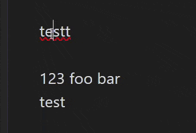

# HTML-style comments (Obsidian plugin)

Convert text to a comment in HTML-style with a hotkey. Multiple selection is supported.

## Demo

## Usage

1. Open `Settings` menu, then `Hotkeys`
2. Enter in the search box: `comment`
3. Assign a hotkey
4. Return to the editor view
5. Place the cursor or select text and press the hotkey

## P.S.

This plugin is similar to MrGVSV's [`Better Comment Toggle`](https://github.com/MrGVSV/obsidian-better-comment-toggle), but the logic is different.